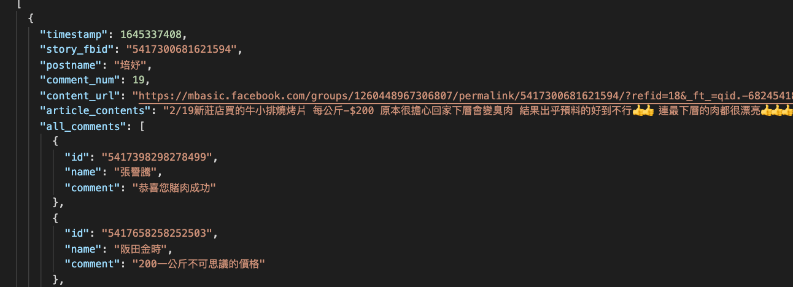

## FB crawler 
> (fb 公開社團爬蟲)
<!-- - FB crawler is an crawler for Facebook group, written in python. -->
- 爬取社團中的所有貼文
    - 貼文時間
    - 貼文編號
    - 貼文者名稱
    - 留言數量
    - 貼文網址
    - 貼文內容
    - 留言內容

- 輸出 JSON 格式

<!-- ## Getting Started

These instructions will get you a copy of the project up and running on your local machine for development and testing purposes. See deployment for notes on how to deploy the project on a live system. -->

### Prerequisites
- python 3.7
- ChromeDriver
- 套件需求
    - selenium
    - bs4
    - requests
    - user_agent


### Installing
- 下載 [ChromeDriver](http://chromedriver.chromium.org/downloads)
    > chromedriver的版本要與你使用的chrome版本對應
- 安裝所需套件
    `pip install -r requirement.txt`


## Running the tests
把 requests_soup.py 中的 ./chromedriver 改成ChromeDriver的路徑
```
webdriver.Chrome(executable_path='Your_Path')
```

執行程式
`python maincrawler.py`

檔案會輸出至 docs/fb_data_{數量}.json


<!-- ### Break down into end to end tests

Explain what these tests test and why

```
Give an example
``` -->

<!-- ### And coding style tests

Explain what these tests test and why

```
Give an example 
```
-->
<!-- ## Deployment

Add additional notes about how to deploy this on a live system -->

<!-- ## Built With

* [Dropwizard](http://www.dropwizard.io/1.0.2/docs/) - The web framework used
* [Maven](https://maven.apache.org/) - Dependency Management
* [ROME](https://rometools.github.io/rome/) - Used to generate RSS Feeds -->

<!-- ## Contributing

Please read [CONTRIBUTING.md](https://gist.github.com/PurpleBooth/b24679402957c63ec426) for details on our code of conduct, and the process for submitting pull requests to us. -->

<!-- ## Versioning

We use [SemVer](http://semver.org/) for versioning. For the versions available, see the [tags on this repository](https://github.com/your/project/tags).  -->

<!-- ## Authors

* **Billie Thompson** - *Initial work* - [PurpleBooth](https://github.com/PurpleBooth)

See also the list of [contributors](https://github.com/your/project/contributors) who participated in this project. -->

<!-- ## License

This project is licensed under the MIT License - see the [LICENSE.md](LICENSE.md) file for details -->

## Acknowledgments

* FB的公開社團爬蟲
* 爬取存html網址(mbasic.facebook.com)


> #### 補充
> 如果留言被回覆超過10次，會增加連結，目前訪入連結會被鎖，無法獲取完整html，因為佔比不多先使用了例外處理過濾，需要做後續修正